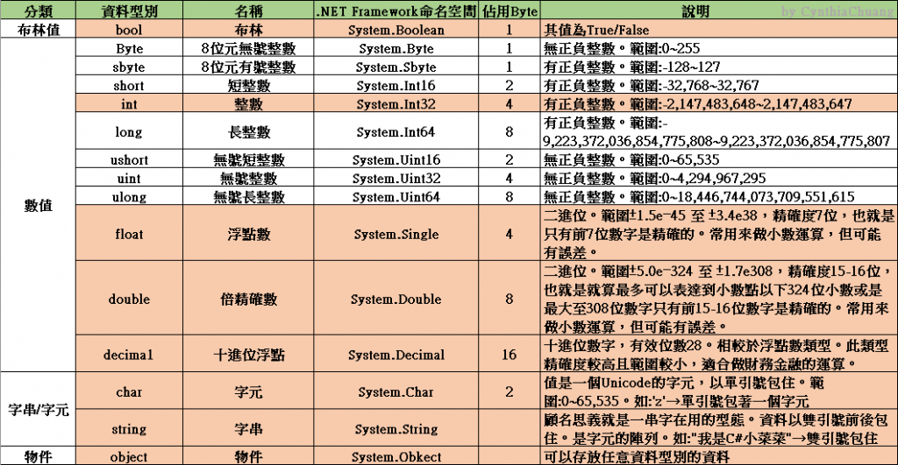

# type_convert
- string
- char
- int
- float
- double
- decimal
- bool



## int
```csharp
int max = int.MaxValue;
int min = int.MinValue;
```

## double
```csharp
double max = double.MaxValue;
double min = double.MinValue;
Console.WriteLine($"The range of double is {min} to {max}");
```

## decimal
```csharp
decimal min = decimal.MinValue;
decimal max = decimal.MaxValue;
Console.WriteLine($"The range of the decimal type is {min} to {max}");
```