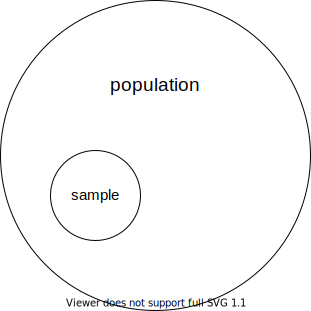

# [Source](https://www.youtube.com/watch?v=uhxtUt_-GyM&list=PL1328115D3D8A2566&ab_channel=KhanAcademy)

## Introduction to descriptive statistics and central tendency. Ways to measure the average of a set: median, mean, mode

## What is Statistics
In very general terms, It's getting your head around data.
It can broadly be classified into maybe three categories.
- Descriptive = you can find indicative numbers that somehow represent all of that data without having to go over all the data.
- Inferential = if we can do some math on the samples, maybe we can make inferences or conclusions about the Maternal data.

## Descriptive
### dataset
1. odd number: [1, 1, 2, 3, 4]
2. even number: [1, 1, 2, 3, 4, 4]
### central tendency (the number that is most representative of a set)
- `central tendency` also called the `average` which you can use following method to measure.
    - mean (arithmetic): (1+1+2+3+4) / 5 = 2.2
    - median: `2` is median in `dataset of odd number`, when you have a set with `even` numbers and someone tells you to figure out the median, what you do is take the middle two numbers and then you take the `arithmetic mean of these two numbers`, so `2.5` is median `in dataset of even number`.
    - mode: what number is most common in a dataset.

In statistic speak, these can kind of be representative of a data set or population's central tendency or sample central tendency, and they are all collectively, be forms of an average.

### Sample and population
if we wanted to know the average height of all 150 million men in America.

it would be nearly impossible, even if I was intent on doing it, to actually measure the average height of every men in America.

So the best way I can get a sense of this, because I'm interested in what the average of the population is, maybe I can take the average of a `sample` (random people and random situations where it wouldn't be skewed based on height).

This would be a sample of the population, `The more people I get the more indicative it is`.

In statistics speak, the `pupulation mean` is "$\mu$" = $\frac{\sum\limits_{i=1}^N x_i}{N}$, and "$\bar{x}$" is equal to `sample mean` = $\frac{\sum\limits_{i=1}^n x_i}{n}$.

> Note that:\
In formula, big "N" is used in poluation mean, and small "n" is used in sample mean.

## Dispersion
### population dataset
1. [2,2,3,3]
2. [0,0,5,5]
### $\mu$ of dataset
1. (2+2+3+3)/4 = 2.5
2. (0+0+5+5)/4 = 2.5

So the arithmetic mean of both of these populations are the same number, but In second situation `each of the distance of number from mean is further away than first`.

You can view them that're more `dispersed`, It's not quite as indicative of all the numbers.

In this case, You can measure that with a `variance` which is 🟥 $\sigma^2$ in math notation, formula is $\frac{\sum\limits_{i=1}^N (x_i-\mu)^2}{N}$, because of you square it which become a `positive number`.

# TODO: use latex to caculate result
### $\sigma$ of dataset
1. 0.25
2. 6.25

we can conclude the more number of sigma the more dispersion.