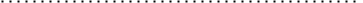

# [Source](https://www.youtube.com/watch?v=uhxtUt_-GyM&list=PL1328115D3D8A2566&ab_channel=KhanAcademy)

## Introduction to descriptive statistics and central tendency. Ways to measure the average of a set: median, mean, mode

## What is Statistics
In very general terms, It's getting your head around data.
It can broadly be classified into maybe three categories.
- **Descriptive** = you can find indicative numbers that somehow represent all of that data without having to go over all the data.
- **Inferential** = if we can do some math on the samples, maybe we can make inferences or conclusions about the Maternal data.

## Descriptive
### dataset
1. odd number: [1, 1, 2, 3, 4]
2. even number: [1, 1, 2, 3, 4, 4]
### central tendency (the number that is most representative of a dataset)
- `central tendency` also called the `average` which you can use following method to measure.
    - mean (arithmetic): (1+1+2+3+4) / 5 = 2.2
    - median: `2` is median in `dataset of odd number`, when you have a set with `even` numbers and someone tells you to figure out the median, what you do is take the middle two numbers and then you take the `arithmetic mean of these two numbers`, so `2.5` is median `in dataset of even number`.
    - mode: what number is most common in a dataset.

In statistic speak, these can kind of be representative of a data set or population's central tendency or sample central tendency, and they are all collectively, be forms of an average.

### Sample and population
if we wanted to know the average height of all 150 million men in America.

it would be nearly impossible, even if I was intent on doing it, to actually measure the average height of every men in America.

So the best way I can get a sense of this, because I'm interested in what the average of the population is, maybe I can take the average of a `sample` (random people and random situations where it wouldn't be skewed based on height).

This would be a sample of the population, `The more people I get the more indicative it is`.


### formula of pupulation mean and sample mean 
In statistics speak, the `pupulation mean` is 🟥 $\mu$
$$
\begin{equation}
	\mu = \frac{\sum\limits_{i=1}^N x_i}{N}
\end{equation}
$$ 
,and 🟥 "$\bar{x}$" is equal to `sample mean` = 
$$
\begin{equation}
	\frac{\sum\limits_{i=1}^n x_i}{n}
\end{equation}
$$.

> Note that:\
In formula, big "N" is used in poluation mean, and small "n" is used in sample mean.

## Dispersion
### population dataset
#### frist dataset
$$
\begin{array}{cc}
	2 & 2 & 3 & 3	
\end{array}
$$
#### second dataset
$$
\begin{array}{cc}
	0 & 0 & 5 & 5
\end{array}
$$

### $\mu$ of dataset
1. (2+2+3+3)/4 = 2.5
2. (0+0+5+5)/4 = 2.5

### 👉 variance notion
So the arithmetic mean of both of these populations are the same number, but In second situation `each of the distance of number from mean is further away than first sitiuation`.

You can view them that're more `dispersed`, It's not quite as indicative of all the numbers.

###  population variance formula
In this case, You can measure that with a `variance` which is 🟥 $\sigma^2$ in math notation, formula is 
$$
\begin{equation}
	\frac{\sum\limits_{i=1}^N (x_i-\mu)^2}{N}
\end{equation}
$$, because of you square it which become a `positive number`.

### $\sigma$ of dataset
the golang calculation process file is in [here](./stat_func/basic_concept.go)
#### result
1. 0.25
2. 6.25

we can conclude the more number of sigma the more dispersion.

## Inferential
You want to estimate things by looking at sample, and this is actually what most of inferential statistic is all about.

Figuring out descriptive statistics about the sample, and making inferences about the population.

### 👉 inferential notion
`Let's me try this drug on 100 people, and if it seems to have statistically significant results, this drug will probably work on the population as a whole.`

### sample variance formula (bias)
So your natural reaction is, Ok, I have this sample, if I want to estimate the variance of the population, why don't I just apply this same formula?

So I could say this $s^2$ is `sample variance` which formula is: 
$$
\begin{equation}
	s_n^2 = \frac{\sum\limits_{i=1}^n(x_i-\bar{x})^2}{n}
\end{equation}
$$


> Note bias_variance:
> when you take a sample, there has some chance that your sample mean is pretty close to the population mean, but there's a reasonable chance that your population mean is always outside of your sample mean. 
> In other word, your sample variance has chance to underestimate or overestimate, but more often than underestimating.


#### intuitive bias variance
Each dot is data all of which represent population dataset more on the right side more larger, you may get all data of sample on the left side or right side of population data. 

As a result you will get bias sample variance. 



### unbiased sample variance
Because sample variance often be underestimated, we usually substract 1 in denominator to get bigger result , using unbiased sample variance instead.

$$
\begin{equation}
	s_{n-1}^2 = \frac{\sum\limits_{i=1}^n({x_i}-\bar{x})^2}{n-1}
\end{equation}
$$

## conclude and standerd deviation
|         Concept         |                       Population                        |                             Sample                             |
| :---------------------: | :-----------------------------------------------------: | :------------------------------------------------------------: |
|          mean           |       $\mu = \frac{\sum\limits_{i=1}^N{x_i}}{N}$        |         $\bar{x} = \frac{\sum\limits_{i=1}^n{x_i}}{n}$         |
|        variance         | $\sigma^2 = \frac{\sum\limits_{i=1}^N({x_i}-\mu)^2}{N}$ | $s_{n-1}^2 = \frac{\sum\limits_{i=1}^n({x_i}-\bar{x})^2}{n-1}$ |
| standerd deviation (SD) |               $\sigma = \sqrt{\sigma^2}$                |                  $s_{n-1} = \sqrt{s_{n-1}^2}$                  |

### why even talk about the standerd deviation?
- the units work out a little better. 
  - If let's say all of our data points, we're measured in meters. if we are taking a bunch of measurements of length, than `the units of the variance would be meter squared`, right? And that's kind of a strange concept if you say the average dispersion from the center has been meter squared. 
  - So well, first when you take the square root of it, getting `SD` then, saying the standard deviation is x or y meters.

### standerd deviation caculate
#### dataset
$$
\begin{array}{cc}
	1 & 2 & 3 & 8 & 7
\end{array}
$$

#### calculation process
##### if it is population
$\mu = \frac{21}{5} = 4.2$
$\sigma^2 = \frac{\sum\limits_{i=1}^{N}({(1-\mu)^2 \dotsc (7-\mu)^2)}}{5} = 7.76 $
$\sigma = \sqrt{7.76} = 2.79$
##### if it is sample
$\bar{x} = \frac{21}{5} = 4.2$
$s^2 = \frac{\sum\limits_{i=1}^{n}({(1-\bar{x})^2 \dotsc (7-\bar{x})^2)}}{4} = 9.7$
$s = \sqrt{9.7}=3.11$

-----

## Experiment preview code chunk with Markdown Preview Enhanced or vscode-markdown-run-snippet

```python {cmd=true}
print("This will run python3 program")
```

```go
package main

import (
	"github.com/montanaflynn/stats"
  	"fmt"
)

func main() {
	population_dataset := map[string]stats.Float64Data{
		"first":  {2, 2, 3, 3},
		"second": {0, 0, 5, 5},
	}
	for dataset_name, data := range population_dataset {
		if result, err := stats.Variance(data); err == nil {
			fmt.Printf("%s dataset variance is %v\n", dataset_name, result)
		}
	}
}
```

```python {cmd=true matplotlib=true}
import matplotlib.pyplot as plt
plt.plot([1,2,3, 4])
plt.show() # show figure
```

```latex {cmd=true}
\documentclass{standalone}
\begin{document}
  Hello world!
\end{document}
```